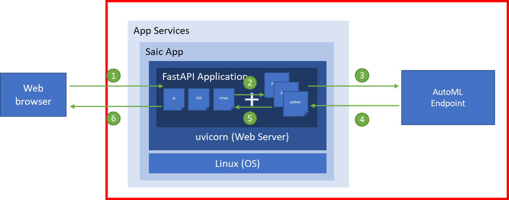

# 교육



### 웹앱 만들기

1. 한국어 바꾸기


2. App Service 이동
3. 만들기 클릭


4. 리소스 생성되면, 리소스로 이동. 왼쪽 구성 클릭
5. 일반 설정 클릭
- HTTPS만 사용 꺼짐 선택

### 소스 코드 다운로드

[https://saic.blob.core.windows.net/container/saic.zip](https://saic.blob.core.windows.net/container/saic.zip)

### FileZilla 다운로드

[https://filezilla-project.org/](https://filezilla-project.org/)

6. 왼쪽 메뉴에서 배포 센터 클릭 후 FTPS 자격 증명 클릭
7. 아래와 같이 설정하고 /에 saic 폴더 드래그 앤 드랍


8. 왼쪽 구성 클릭, 일반 설정 클릭
- 시작 명령에 아래 내용 복사하여 붙여넣기

```
pip install fastapi
pip install "uvicorn[standard]"
pip install pydantic
cd /home/saic && uvicorn main:app --port 8000 --host 0.0.0.0
```

9. 왼쪽 개요 클릭, 기본 도메인 클릭

